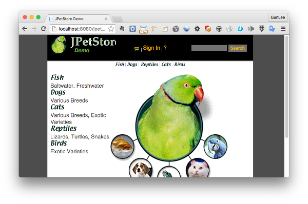
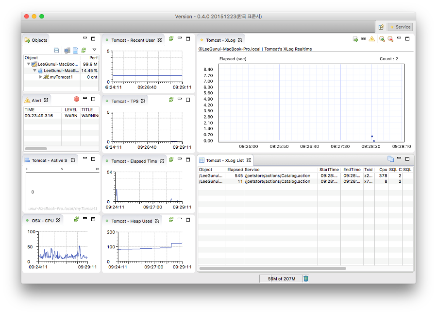
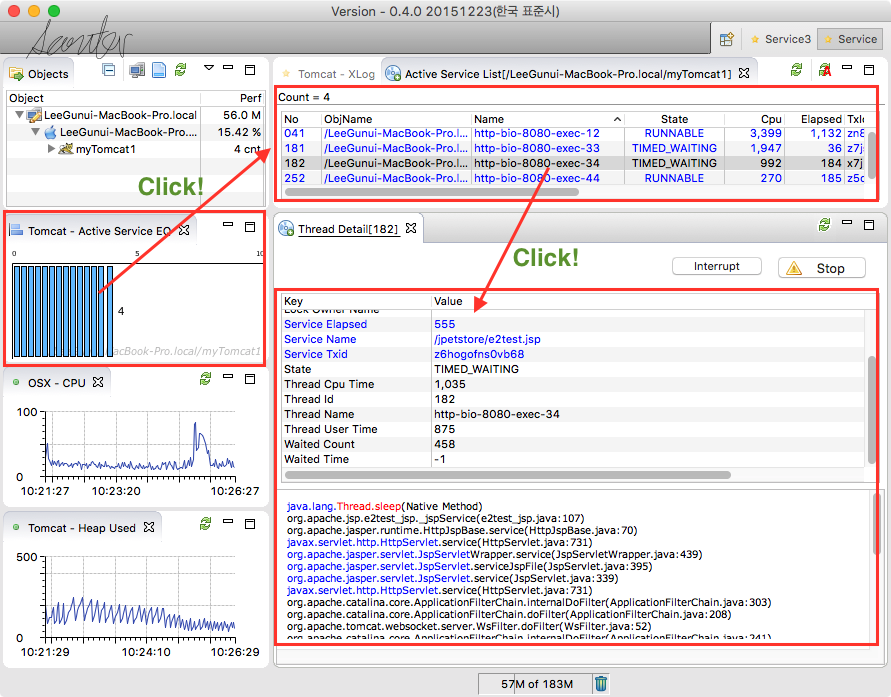
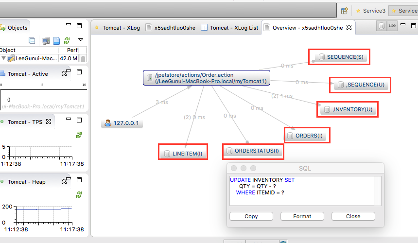

# Quick Start
[](Quick-Start.md) 

If the first time on the Scouter, you can try simply install and run through this page .

Here that have already been created through the sample system can be seen to verify the functionality of the Scouter.
You can see it up and running within a few minutes to a few commands to download files that are provided.

This quick Start proceeds in the following order.

> 1. **Download** integrated demonstration environment and the client program
> 2. decompress download file. - **Installation completed!**
> 3. Run Scouter Server(Collector)
> 4. Run Client(Viewer)
> 5. Run Host Agent - optional
> 6. Run demonstration system (Tomcat with WAR)
> 7. **Demonstration system access via a web browser**
> 8. load test by the jmeter

## Requirement
* JDK 7+ (& environment variable JAVA_HOME to be set)
* Windows / Linux / OS X

If No JDK, You have to download and install JDK first with the [oracle.com](http://www.oracle.com/technetwork/java/javase/downloads/jdk8-downloads-2133151.html).
JAVA_HOME이 설정되지 않았다면 OS의 환경 변수로 설정하거나 이후에 설명하는 Tomcat 실행 부분에서 실행 script에 추가하도록 한다.
If you have not set the environment variable JAVA_HOME, add to the OS env variables or modify running scripts that describe later on `Run demonstration system` section.

## architecture 
Modules           | desc
----------------- | --------------------------
Server(Collector) | processing data that agent transfer to
Host Agent        | transfer CPU, Memory, Disk performance information to the collector
Java Agent        | transfer real time performance data of the java program such as Heap Memory, Thread, Profiles to the collector
Client(Viewer)    | Client program to check the collected performance information


## Installation Scouter and run

#### (1) **Download** integrated demonstration environment and the client program
 - Download integrated demonstration environment
   - [Download demo-env1.tar.gz](https://github.com/scouter-project/scouter-demo/releases/download/v0.0.3/demo-env1.tar.gz) (Collector Server, Host Agent, Java Agent, Tomcat, 샘플 시스템, 설정, 기동 스크립트가 포함됨)
   - Windows Case [demo-env1.zip 다운로드](https://github.com/scouter-project/scouter-demo/releases/download/v0.0.3/demo-env1.zip)

 - Download client program
   - download the client for your environment.
    - [scouter.client.product-win32.win32.x86_64.zip](https://github.com/scouter-project/scouter-demo/releases/download/v0.0.1/scouter.client.product-win32.win32.x86_64.zip)
    - [scouter.client.product-win32.win32.x86.zip](https://github.com/scouter-project/scouter-demo/releases/download/v0.0.1/scouter.client.product-win32.win32.x86.zip)
    - [scouter.client.product-macosx.cocoa.x86_64.tar.gz](https://github.com/scouter-project/scouter-demo/releases/download/v0.0.1/scouter.client.product-macosx.cocoa.x86_64.tar.gz)
    - [scouter.client.product-linux.gtk.x86_64.tar.gz](https://github.com/scouter-project/scouter-demo/releases/download/v0.0.1/scouter.client.product-linux.gtk.x86_64.tar.gz)

#### (2) decompress downloaded file.
 decompress file and all installation is done.
 decompress demo-env1.tar.gz to any directory you want to.
 
#### (3) Run scouter Server(Collector)
 run the command below at the directory you decompressed file.
 ```bash
 start-scouter-server.sh
 ```
 > Windows : 
 > ```bat
 > start-scouter-server.bat
 > ```

#### (4) Run Client(Viewer)
 decompress the client file you downloaded.
 Click scouter client execution file and run.
 
 On the login form, you can login with 127.0.0.1:6100 for collector server and admin/admin for default id/password.
 


#### (5) Run Host Agent(Optional)
 Run host agent for monitoring CPU, memory, IO and more of the OS.
 ```bash
 start-scouter-host.sh
 ```
 > Windows : 
 > ```bat
 > start-scouter-host.bat
 > ```

#### (6) Run demonstration system (Tomcat with WAR)
 ```bash
 start-tomcat.sh
 ```

 > Windows 
 > ```bat
 > start-tomcat.bat
 > ```

If you met the error below, you may not set JAVA_HOME.
You can set JAVA_HOME on your os environment variable or modify some files - start-tomcat.bat and stop-tomcat.bat.(or .sh)
```
Neither the JAVA_HOME nor the JRE_HOME environment variable is defined
At least one of these environment variable is needed to run this program
```

for example, you can modify start-tomcat.bat and set JAVA_HOME for java installed directory like below on a Windows system. 
`set JAVA_HOME=C:\Program Files\Java\jdk1.8.0_25`

```bat
@echo off
setlocal
set JAVA_HOME=C:\Program Files\Java\jdk1.8.0_25
set originDir=%cd%
cd /D %~dp0
cd apache-tomcat-7.0.67\bin
startup.bat
cd /D %originDir%
```

#### (7) Demonstration system access via a web browser
Run a browser(chrome, safari...) and you can see the demo system while access http://127.0.0.1:8080/jpetstore.
And also you can see the web service request you triggered on the scouter client within 2 seconds.




#### (8) load test by the jmeter
You can make virtual load for verifying scouter's funtionality.
run the command below, will load by jmeter in 5 minutes.
If you want to stop jmeter load, please press CTRL+C.

```bash
start-jmeter.sh
```
 > Windows
 > ```bat
 > start-jmeter.bat
 > ```


# Scouter Client Quick Guide
This section will describe how the monitoring application via the scouter.

## 1. How to check running thread details
You can see running threads on Active Service View.
We can find why our system is so slow, why this request don't response, what is this thread doing now, what's slow thread, what's stucked thread by this view.
It display yellow color if the service is over than 3 seconds and red color 8 seconds.




## 2. Service anlaysis by the XLog profiling data
The XLog graph shows completed request and more detail profiles when drag the area you want to see detail.


## 3. Trace chained service ( Service architecture lik SOA, MSA ... )
set `trace_interservice_enabled=true` on java agent configuration to enable HTTP inter-service trace.
You can see the profile below when you drag XLog and select `e2e.jsp`


click the `call:..` on profile to get the another profile of callee service and click the `caller id` on top of profile summary to get back.

Also you can see service call tree diagram by click the `gxid` - from an user to database tables via services.
If click a table name again, used query on the table will be popped up.


The flag (S/U/D) by a table name means Select, Update, Delete query each.




## 4. Advanced features of the Scouter

Please read the detail manual pages for advanced features.

function     |    description
------------ | --------------
SFA (Stack Frequency Analyzer)  | Thread Stack의 통계 분석을 통한 부하 코드 식별
[Trace connection Leak](./tech/JDBC-Connection-Leak-Trace.md)           | Database Connection Leak 추적
Add user id on a profile        | profile customizing with a plugin scripting feature.
method profiling               | how to profile deeper - method level profiling
[Trace Non-Servlet Java application](./use-case/NON-HTTP-Service-Trace.md)    | how to monitoring Non-Servlet Java application like socket deamons.

