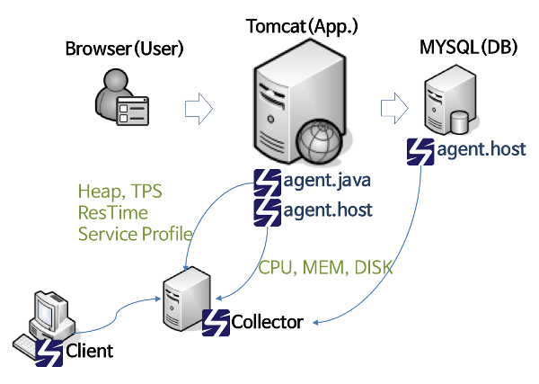

# Quick Start
[](Quick-Start.md) 

Scouter를 처음 시작한다면 이 페이지를 통해 간단히 설치하고 실행 해 볼 수 있다.

여기서는 이미 만들어진 샘플 시스템을 통하여 Scouter의 기능을 확인 해 볼 수 있으며
제공되는 데모 파일을 다운로드 받았다면 명령어 몇 개로 수분내에 설치하여 실행해 볼 수 있다.

Quick Start는 아래와 같은 순서로 진행 된다.

> 1. 통합 데모 환경 및 클라이언트 프로그램 **다운로드**
> 2. 압축 파일 해제 - **이것으로 설치 완료!**
> 3. Scouter Server(Collector) 실행
> 4. Client(Viewer) 실행
> 5. Host Agent 실행
> 6. 데모 시스템 실행(Tomcat with WAR)
> 7. **브라우저를 통해 데모 시스템 접속**
> 8. jmeter를 통한 가상의 부하 발생

## Requirement
* JDK 7+ (& JAVA_HOME 환경변수 설정)
* Windows / Linux / OS X

JDK가 없다면 먼저 [oracle.com](http://www.oracle.com/technetwork/java/javase/downloads/jdk8-downloads-2133151.html) 을 통해 다운로드 하여 설치하도록 한다.
JAVA_HOME이 설정되지 않았다면 OS의 환경 변수로 설정하거나 이후에 설명하는 Tomcat 실행 부분에서 실행 script에 추가하도록 한다.


## Scouter의 구성
Modules           | 설명
----------------- | --------------------------
Server(Collector) | Agent가 전송한 데이터 수집/처리
Host Agent        | OS의 CPU, Memory, Disk등의 성능 정보 전송
Java Agent        | 실시간 서비스 성능 정보, Heap Memory, Thread 등 Java 성능 정보
Client(Viewer)    | 수집된 성능 정보를 확인하기 위한 Client 프로그램



## Scouter의 설치 및 실행

#### (1) 통합 데모 환경 및 클라이언트 프로그램 다운로드
 - 통합 데모 환경 다운로드
   - [demo-env1.tar.gz 다운로드](https://github.com/scouter-project/scouter-demo/releases/download/v0.0.3/demo-env1.tar.gz) (Collector Server, Host Agent, Java Agent, Tomcat, 샘플 시스템, 설정, 기동 스크립트가 포함됨)
   - Windows의 경우 [demo-env1.zip 다운로드](https://github.com/scouter-project/scouter-demo/releases/download/v0.0.3/demo-env1.zip)

 - Client 다운로드
   - 자신의 환경에 맞는 파일을 다운로드 받는다.
    - [scouter.client.product-win32.win32.x86_64.zip](https://github.com/scouter-project/scouter-demo/releases/download/v0.0.1/scouter.client.product-win32.win32.x86_64.zip)
    - [scouter.client.product-win32.win32.x86.zip](https://github.com/scouter-project/scouter-demo/releases/download/v0.0.1/scouter.client.product-win32.win32.x86.zip)
    - [scouter.client.product-macosx.cocoa.x86_64.tar.gz](https://github.com/scouter-project/scouter-demo/releases/download/v0.0.1/scouter.client.product-macosx.cocoa.x86_64.tar.gz)
    - [scouter.client.product-linux.gtk.x86_64.tar.gz](https://github.com/scouter-project/scouter-demo/releases/download/v0.0.1/scouter.client.product-linux.gtk.x86_64.tar.gz)

#### (2) 압축 파일 해제
 압축 파일을 해제 함으로써 기본적인 설치가 완료 된다.
 다운로드 받은  demo-env1.tar.gz 를 적당한 위치에 압축 해제 한다.
 
#### (3) Scouter Server(Collector) 실행
 압축을 푼 위치에서 아래 명령 파일을 실행한다.
 ```bash
 start-scouter-server.sh
 ```
 > Windows : 
 > ```bat
 > start-scouter-server.bat
 > ```

#### (4) Client(Viewer) 실행
 다운로드 받은 Client를 적절한 위치에 압축 해제 한다
 scouter client를 클릭하여 실행한다.

 Collector Server의 IP 를 127.0.0.1:6100, id/password를 admin/admin을 입력하여 로그인 한다.
 


#### (5) Host Agent 실행(Optional)
 OS의 CPU, 메모리, IO등 자원 모니터링을 위한 Host Agent를 실행한다.
 ```bash
 start-scouter-host.sh
 ```
 > Windows : 
 > ```bat
 > start-scouter-host.bat
 > ```

#### (6) 데모 시스템 실행(Tomcat with WAR)
 ```bash
 start-tomcat.sh
 ```

 > Windows 
 > ```bat
 > start-tomcat.bat
 > ```

만약 Tomcat 실행시 아래와 같은 에러를 만난다면 JAVA_HOME이 설정되지 않은 것이므로 OS 환경변수에 JAVA_HOME을 설정하거나
start-tomcat.bat와 stop-tomcat-bat 파일을 수정한다.
```
Neither the JAVA_HOME nor the JRE_HOME environment variable is defined
At least one of these environment variable is needed to run this program
```

예를 들면 Windows에서 아래와 같이 start-tomcat.bat 배치 파일을 수정하여 아래와 같이 JAVA가 설치된 경로로 JAVA_HOME을 설정할 수 있다.
```bat
@echo off
setlocal
set JAVA_HOME=C:\Program Files\Java\jdk1.8.0_25
set originDir=%cd%
cd /D %~dp0
cd apache-tomcat-7.0.67\bin
startup.bat
cd /D %originDir%
```

#### (7) 브라우저를 통해 데모 시스템 접속
브라우저를 실행하여 http://127.0.0.1:8080/jpetstore에 접속하면 데모시스템이 실행되는 것을 볼수 있다.
또한 브라우저에서 요청을 발생시키면 Scouter Client에서 실시간으로(2초내에) 이를 확인할 수 있다.


#### (8) jmeter를 통한 가상의 부하 발생
모니터링이 잘 되는지 확인하기 위해 jmeter를 통해 가상의 부하를 발생시킬 수 있다.
아래와 같이 jmeter를 실행하면 5분간 부하가 발생된다.
jmeter를 중지하기 위해서는 CTRL+C 를 누르면 된다.
```bash
start-jmeter.sh
```
 > Windows
 > ```bat
 > start-jmeter.bat
 > ```


# Scouter Client Quick Guide
여기서는 Client를 통해 서비스를 어떻게 모니터링 하는지를 간단히 설명한다.

## 1. 실행중인 서비스 확인
## 2. XLog 프로파일을 통한 서비스 분석
## 3. 서비스 연계 추적