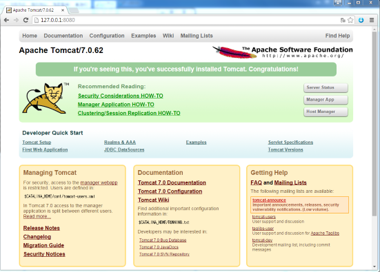
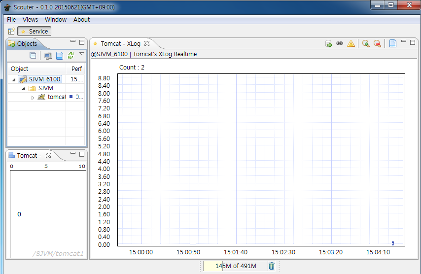

# Quick Start
[](Quick-Start.md) 

Scouter를 처음 시작한다면 이 페이지를 통해 간단히 설치하고 실행 해 볼 수 있다.

여기서는 이미 만들어진 샘플 시스템을 통하여 Scouter의 기능을 확인 해 볼 수 있으며
제공되는 데모 파일을 다운로드 받았다면 명령어 몇 개로 수분내에 설치하여 실행해 볼 수 있다.

Quick Start는 아래와 같은 순서로 진행 된다.

> 1. 통합 데모 환경 및 클라이언트 프로그램 **다운로드**
> 2. 압축 파일 해제 - **이것으로 설치 완료!**
> 3. Scouter Server(Collector) 실행
> 4. Client(Viewer) 실행
> 4. Host Agent 실행
> 5. 데모 시스템 실행(Tomcat with WAR)
> 6. **브라우저를 통해 데모 시스템 접속**
> 7. Scouter Client 대시보드를 통해 데이터 확인
> 8. jmeter를 통한 부하 발생
> 9. Scouter Client 대시보드를 통해 데이터 확인

## Requirement
* JDK 7+ (& JAVA_HOME 환경변수 설정)
* Windows / Linux / OS X

JDK가 없다면 먼저 [oracle.com](http://www.oracle.com/technetwork/java/javase/downloads/jdk8-downloads-2133151.html) 을 통해 다운로드 하여 설치하도록 한다.
JAVA_HOME이 설정되지 않았다면 OS의 환경 변수로 설정하거나 이후에 설명하는 Tomcat 실행 부분에서 실행 script에 추가하도록 한다.

## Scouter의 설치 및 실행

### 1. 통합 데모 환경 및 클라이언트 프로그램 다운로드
 - 통합 데모 환경 다운로드
   - [demo-env1.tar.gz 다운로드](https://github.com/scouter-project/scouter-demo/releases/download/v0.0.2/demo-env1.tar.gz) (Collector Server, Host Agent, Java Agent, Tomcat, 샘플 시스템, 설정, 기동 스크립트가 포함됨)
   > For Windows
   > [demo-env1.zip 다운로드](https://github.com/scouter-project/scouter-demo/releases/download/v0.0.2/demo-env1.zip)


 - Client 다운로드
   - 자신의 환경에 맞는 파일을 다운로드 받는다.
    - [scouter.client.product-win32.win32.x86_64.zip](https://github.com/scouter-project/scouter-demo/releases/download/v0.0.1/scouter.client.product-win32.win32.x86_64.zip)
    - [scouter.client.product-win32.win32.x86.zip](https://github.com/scouter-project/scouter-demo/releases/download/v0.0.1/scouter.client.product-win32.win32.x86.zip)
    - [scouter.client.product-macosx.cocoa.x86_64.tar.gz](https://github.com/scouter-project/scouter-demo/releases/download/v0.0.1/scouter.client.product-macosx.cocoa.x86_64.tar.gz)
    - [scouter.client.product-linux.gtk.x86_64.tar.gz](https://github.com/scouter-project/scouter-demo/releases/download/v0.0.1/scouter.client.product-linux.gtk.x86_64.tar.gz)

### 2. 압축 파일 해제
 압축 파일을 해제 함으로써 기본적인 설치가 완료 된다.
 다운로드 받은  demo-env1.tar.gz 를 적당한 위치에 압축 해제 한다.
 
### 3. Scouter Server(Collector) 실행
 압축을 푼 위치에서 아래 명령 파일을 실행한다.
 `start-scouter-server.sh`
 > Windows : `start-scouter-server.bat`

### 4. Client(Viewer) 실행
 다운로드 받은 Client를 적절한 위치에 압축 해제 한다
 scouter client를 클릭하여 실행한다.

 Collector Server의 IP 를 127.0.0.1:6100, id/password를 admin/admin을 입력하여 로그인 한다.
 


### Install JDK
oracle.com으로 가서 JDK7을 다운받아 설치한다.
```
jdk-7u79-windows-i586.exe
jdk-7u79-linux-x64.tar.gz(Linux 64)
Ref)http://www.oracle.com/technetwork/java/javase/downloads/jdk7-downloads-1880260.html
```
나머지는 일반적인 JDK설치가이드에 따른다.

주의)설치 디렉토리는 상관없지만 JRE버전이 아니라 JDK버전을 설치해야한다.

### Tomcat 설치
JDK7과 호환되는 Tomcat을 설치한다. 서비스 등록이 아니면 동일 버전을 Linux나 윈도우에 설치가능함으로 Tomcat7버전을 받아서 설치한다.
```
apache-tomcat-7.0.62.zip
http://tomcat.apache.org/download-70.cgi
```
톰켓 설치는 단순히 정해진 디렉토리에 압축을 풀어놓음으로써 완료될 수 있다.

C:\Tomcat7 에 Tomcat이 설치되어있다고 가정한다. 만약 다른 디렉토리에 설치했다면 그에 맞춰주기 바란다.


### 실행하기
톰켓을 실행하여 브라우저로 접속해 본다. 자세한 사항은 Apache문서를 참조한다.

http://tomcat.apache.org/tomcat-7.0-doc/index.html

${TOMCAT_HOME}/bin에 가면 startup.bat/startup.sh가 있다. 이 쉘을 실행하면 톰켓이 기동된다.

JAVA_HOME이 정상적으로 설정되지 않으며 다음과 같은 에러가 발생한다.
```
c:\Tomcat7\bin>startup.bat
Neither the JAVA_HOME nor the JRE_HOME environment variable is defined
At least one of these environment variable is needed to run this program
```
c:\Tomcat7\bin>set JAVA_HOME=c:\java7

정상적으로 설치되고 c:\Tomca7\bin\startup.bat를 실행하면

```
6월 22, 2015 2:11:27 오후 org.apache.catalina.startup.HostConfig deployDirectory

정보: Deployment of web application directory C:\Tomcat7\webapps\ROOT has finish
ed in 94 ms
6월 22, 2015 2:11:27 오후 org.apache.coyote.AbstractProtocol start
정보: Starting ProtocolHandler ["http-bio-8080"]
6월 22, 2015 2:11:27 오후 org.apache.coyote.AbstractProtocol start
정보: Starting ProtocolHandler ["ajp-bio-8009"]
6월 22, 2015 2:11:27 오후 org.apache.catalina.startup.Catalina start
정보: Server startup in 1251 ms
```
위와 같은 메세지를 볼 수 있다.

브라우저를 이용해서 http://127.0.0.1:8080 에 접속해서 화면이 출력되면 톰켓 설치가 완료 된 것이다.



## Scouter 설치하기
톰켓 모니터링을 위해 스카우터는 3가지 컴포넌트를 설치해야한다. 본 예제에서는 모든 컴포넌트를 한 서버에 설치한다


### Agent 설치 및 실행
에이전트 컴포넌트를 다운 받는다.

https://github.com/scouter-project/scouter/releases/download/v0.4.0/scouter.agent.tar.gz

c:\에 압축을 풀면 c:\scouter\agent\scouter.agent.jar파일이 만들어진다.
기동 쉘을 만든다. C:\Tomcat7\bin\scouter.bat
파일 내용은 아래와 같다.

```
set JAVA_HOME=c:\java7
set JAVA_OPTS=-javaagent:c:\scouter\agent.java\scouter.agent.jar
startup.bat
```
Tomcat을 다시 실행하면 시작 창에서 아래와 같은 메세지를 볼 수 있다.
```
  ____                  _
 / ___|  ___ ___  _   _| |_ ___ _ __
 \___ \ / __/   \| | | | __/ _ \ '__|
  ___) | (_| (+) | |_| | ||  __/ |
 |____/ \___\___/ \__,_|\__\___|_|
 Scouter version 0.4.0 20151213
 Open Source S/W Performance Monitoring

20150622 14:31:53 [SCOUTER] loaded by system classloader
20150622 14:31:57 [SCOUTER] jar:file:/C:/scouter/agent.java/scouter.agent.jar
20150622 14:31:57 [SCOUTER] Version 0.4.0 20151213
```
If you see the above message, the installation of Agent will succeed


## Collector Server 설치 및 실행
데이터를 받아서 저장할 서버를 설치한다. 먼저 github에서 서버를 다운로드 받는다.

https://github.com/scouter-project/scouter/releases/download/v0.4.0/scouter.server.tar.gz

agent와 마찮가지로 c:\에서 압축을 풀면 c:\scouter\server*.* 디렉토리와 파일이 만들어진다.

RUN "C:\scouter\server\startup.bat"

```
C:\scouter\server>java -Xmx512m -classpath ./boot.jar scouter.boot.Boot ./lib
  ____                  _
 / ___|  ___ ___  _   _| |_ ___ _ __
 \___ \ / __/   \| | | | __/ _ \ '__|
  ___) | (_| (+) | |_| | ||  __/ |
 |____/ \___\___/ \__,_|\__\___|_|
 Scouter version 0.4.0 20151213
 Open Source S/W Performance Monitoring

System JRE version : 1.7.0_67

```

위와 같은 실행모습을 볼 수 있다.

## Client 설치 및 실행
클라이언트는 Eclipse RCP로 개발되어있다. 따라서 각 OS에 맞는 버전을 다운받아 설치하면된다.
여기서는 Windows 32bit 용 파일을 다운받는다.
https://github.com/scouter-project/scouter/releases/download/v0.4.0/scouter.client.product-win32.win32.x86.zip
파일을 c:\scouter.에 복사한 후에 압축을 풀고 c:\scouter\scouter\scouter.exe 을 실행한다.
실행시 로그인 창이 나타난다. 입력 창에 다음과 같이 입력한다.

```
Server Address : 127.0.0.1:6100
ID : admin
Password : admin
```



## 마무리
이제 브라우저를 통해 톰켓에 어떤 서비스를 요청하면 화면에 그 결과가 Dot로 출력 되는 것을 볼 수 있다.
각 Dot는 하나의 서비스 호출(트랜잭션)의 수행정보를 담고 있으며 상세한 정보를 보기 위해서는 왼쪽 마우스로 화면을 드레그하면 사각박스가 나타나는데 그 박스를 이용해서 분석하고자하는 Dot들을 선택한다.